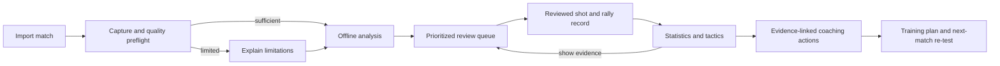
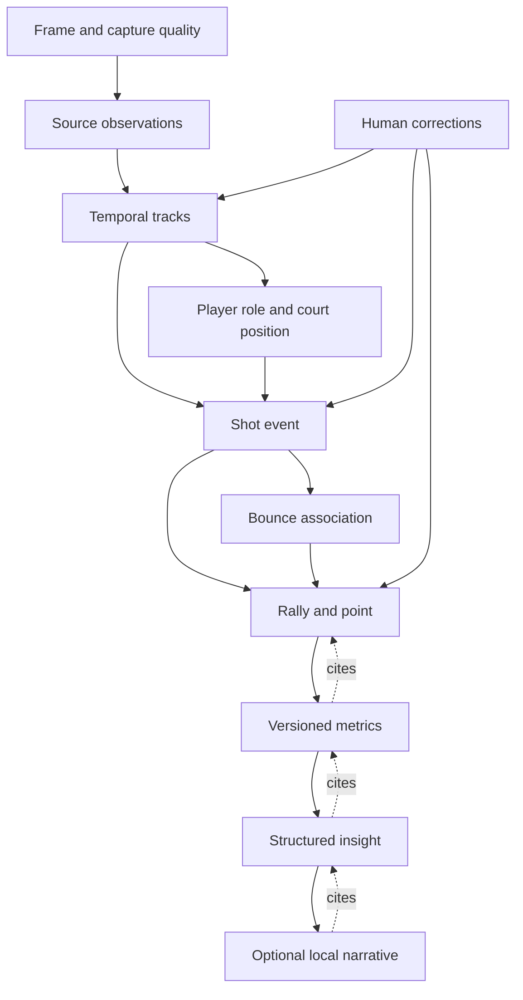
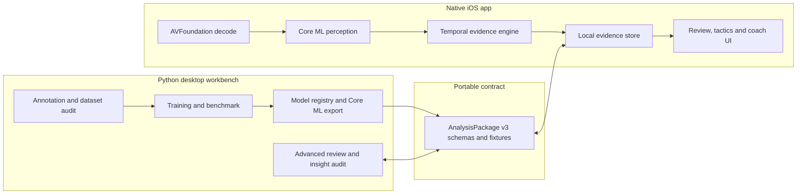
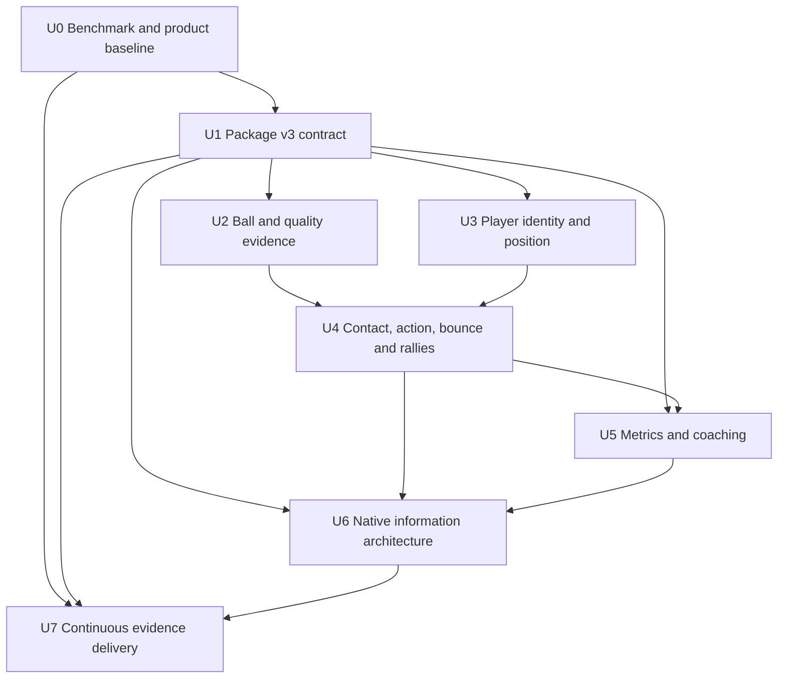
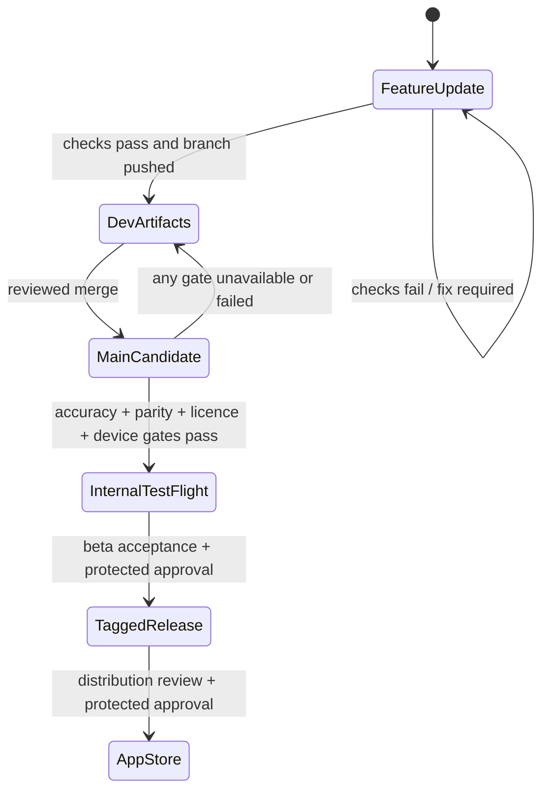

# Evidence-first tennis coaching intelligence upgrade

## Decision summary

The product should become a local tennis coach with a traceable evidence chain:

> video → reviewable observations → shots and rallies → statistics and tactics →
> evidence-linked coaching actions

The first validated product target is singles recorded by a fixed phone that shows the
full court. The desktop application remains the data, evaluation and expert-review
workbench; the native iOS app becomes the everyday player and coach experience.

This is not primarily a larger-model project. The immediate bottleneck is that ball
observation is incomplete, false positives exist, player identity is unstable and current
hit/bounce/rally events are unvalidated candidates. The implementation therefore starts
with contracts, annotation and match-grouped evaluation, then improves perception, and
only then promotes statistics and coaching claims.

“Publish every update” is implemented as automatic branch push plus development artifacts
after a coherent batch passes its checks. Production distribution remains gated: ordinary
feature updates must not silently become formal App Store releases.

## 1. Goal capsule

### 1.1 Desired outcome

A player imports a match, receives an honest quality assessment, reviews only ambiguous or
high-impact moments, and can then answer:

- What shots did I play, from where, toward which zones, and with what result?
- Which rally and court-position patterns help or hurt me?
- What should I change in my next match or training session?
- Which clips and reviewed events support each conclusion?

### 1.2 Current baseline

The repository already provides video import, ball/player/racket/pose detections, court
calibration, AnalysisPackage v2, candidate hit/bounce/rally events, exact-frame correction,
reviewed-only counts, clip export, a desktop workbench and an offline native iOS development
app. The latest checked-in validation also records the limiting evidence:

- full-broadcast observed-ball coverage was 49.56%, with another 6.53% interpolated;
- a scoreboard element produced a ball false positive and player IDs were unstable;
- 112 hit, 54 bounce and 24 rally candidates were produced, but none was confirmed;
- the trained ball candidate failed its held-out promotion gate;
- no validated automatic five-stroke classifier, phone accuracy report, Core ML parity
  result or physical-device performance result exists.

Coverage is availability, not correctness. These numbers define the starting problem and
must not be presented as model accuracy.

### 1.3 Initial operating assumptions

| Topic | Default for the first release | Expansion path |
|---|---|---|
| Capture | Fixed tripod/stand, full court visible, 1080p30 or better | Handheld and broadcast after separate validation |
| Match | Singles | Doubles remains representable and receives its own gate |
| Users | Player first; coach can review/export | Team and academy collaboration later |
| Processing | Offline and on-device by default | Optional desktop-assisted heavy analysis |
| Truth | Reviewed evidence is publishable fact | Calibrated high-confidence auto-accept after validation |
| Language | Chinese and English UI/narrative | Additional localizations later |

If footage violates the capture assumptions, the app should degrade explicitly—showing a
quality warning, suppressing unsupported metrics and still allowing manual review—rather
than fabricating a complete analysis.

## 2. Product concept and concrete user prompts

### 2.1 Product concept

Working concept: **Tennis Evidence Coach**.

Its distinguishing behavior is not merely drawing detections. It turns match video into a
small, inspectable record of each shot and rally, then uses that record to explain tactical
patterns. Every insight offers “why”, “show evidence” and “what to train next”.

The product has three confidence modes:

1. **Candidate** — generated automatically and not yet trusted for verified statistics.
2. **Reviewed** — accepted or corrected by a person and eligible for verified metrics.
3. **Derived** — calculated from eligible evidence and carrying the IDs, model version and
   review state of its inputs.

Candidate evidence may appear in an **Assisted estimate** view when it is clearly labelled
and its coverage/confidence are visible. It never enters the **Human-verified** view. A
future versioned auto-accept policy may make calibrated fields eligible without individual
review, but only after its own held-out and review-burden gate; until then, verified metrics
require human-reviewed inputs.

### 2.2 User jobs

| Actor | Job to be done | Required outcome |
|---|---|---|
| Player | Understand one match without watching it end to end | A concise match story with clips and actionable priorities |
| Player | Compare a known weakness across matches | Consistent filters, comparable definitions and honest sample sizes |
| Coach | Verify observations and challenge a conclusion | Frame-accurate editing and evidence traversal |
| Coach | Turn analysis into a session | A drill plan tied to a measured pattern, not generic advice |
| Researcher/developer | Improve a model safely | Frozen splits, reproducible benchmarks and promotion gates |

### 2.3 Concrete in-app prompts

The following are product interactions, not unrestricted chat. The app translates them to
structured filters and metrics, then narrates only available evidence.

| User prompt | Structured operation | Expected answer |
|---|---|---|
| “分析我最近一场单打，先告诉我最值得改的两个问题。” | Select latest eligible match; rank robust negative patterns by effect, support and confidence | Two priorities, sample size, effect direction, confidence, and evidence clips |
| “比较我的正手和反手落点深度，忽略未确认事件。” | Filter reviewed groundstrokes; group by stroke; calculate valid bounce depth | Court map, median/deep-zone rate, denominators and excluded-data count |
| “为什么我在 5 拍以上的回合更容易输？” | Filter rallies with at least five verified shots and known outcome; mine interpretable sequence features | Supported positional/shot pattern, counterexamples and “insufficient evidence” when outcome labels are missing |
| “我接发后是不是退得太靠后？把证据片段给我。” | Find reviewed return contacts; compare hitter court position with personal baseline; fetch clips | Position distribution, threshold definition and linked clips |
| “找出我反手被压制后打短球的回合。” | Query shot sequences: backhand under positional pressure followed by shallow landing | Matching rallies on a timeline and court map; no result if contact/landing is uncertain |
| “只看第二盘，比较我和对手的击球站位。” | Apply set and player filters; compare court-position distributions | Side-by-side heatmaps with court-orientation normalization |
| “根据这两场比赛给我安排下一次 60 分钟训练。” | Combine only comparable reviewed evidence; map top pattern to drill library | Warm-up, two evidence-linked drills, progression, measurable target and re-test plan |
| “这条建议靠谱吗？” | Expand insight provenance | Metric definition, sample size, uncertainty, model/review status and supporting/contradicting clips |

Examples of correct abstention:

- “这场比赛没有可靠的比分或回合胜负标签，无法判断长回合是否更容易输；我可以先比较长回合中的站位和落点。”
- “后场球员在 18 个候选击球中有 7 个被遮挡，当前只显示 11 个已确认样本。”
- “我检测到画面裁切，落点热图在重新校准前暂停更新。”

### 2.4 Implementation master prompt

Agents implementing a product slice should receive a concrete prompt in this form:

```text
Implement <U-ID> for the evidence-first tennis coaching product.

User outcome: <observable behavior>.
Requirements: <R-IDs>.
Allowed files: <explicit paths>.
Inputs and contracts: <schemas, fixtures, upstream unit results>.
Non-negotiable evidence rules: preserve null/uncertain states; candidates do not enter
verified metrics; landing requires bounce evidence; derived outputs cite input IDs.
Acceptance scenarios: <AE-IDs and unit-specific cases>.
Required checks: <targeted checks plus affected full suite>.

Return only a delta capsule: decisions, files changed, checks and results, evidence created,
remaining risks, and the exact next dependency. Do not change shared contracts or release
gates outside this unit.
```

## 3. UI, functions and expected user effects

### 3.1 Native app information architecture

The current long review screen should become five focused destinations. Match-level
navigation is a compact tab bar; event details open as sheets or drill-down pages.

| Surface | Main UI | Function | Expected user effect |
|---|---|---|---|
| **Overview** | Analysis-quality banner, score/context, two key findings, progress and review queue | Summarize eligible evidence; expose missing inputs and processing state | User understands what is known and where attention is needed within 30 seconds |
| **Review** | Video, synchronized timeline, shot markers, filters, correction sheet | Accept/correct hitter, stroke, contact time, court position, bounce and outcome | Human effort is concentrated on ambiguity instead of replaying the whole match |
| **Court** | Normalized court map, shot arrows, landing/position layers, player/stroke filters | Explore spatial distributions and inspect any point's source clip | Spatial claims become intuitive and auditable |
| **Tactics** | Rally-length bands, serve/return patterns, sequence cards, comparison controls | Aggregate shots/rallies and compare self, opponent, set or match | Player sees repeatable patterns rather than isolated highlights |
| **Coach** | Prioritized recommendation cards, evidence drawer, training-plan builder | Map robust patterns to a curated intervention and measurable re-test | Analysis ends in one or two concrete behavior changes |

The match library remains the entry surface. Desktop retains Matches, Video Review, Events
and Settings, then gains Dataset, Benchmark and Insight Audit views as implementation
progresses.

Before analysis, Match Setup asks the user to identify themself and the opponent, confirm
singles/doubles and court orientation, and optionally enter set/score context. At every scene
or side change, the app proposes how near/far tracks map to those persistent participants;
ambiguous mappings enter review instead of silently swapping player statistics.

### 3.2 End-to-end user flow



Expected time-to-value targets, measured on supported footage after device validation:

- import-to-quality-result: under 30 seconds;
- first useful assisted summary and prioritized queue: no more than 10 high-impact review
  decisions for a typical set after the corresponding model gate passes;
- human-verified summary: available only when the selected metric's explicit review-coverage
  policy is met; the UI always shows that coverage rather than implying completeness;
- any chart-to-source-clip navigation: at most two taps;
- correction persistence: visible immediately and preserved after app restart/export;
- unsupported metric: explained in place, never shown as zero.

### 3.3 Review interactions

Each shot card shows:

- event time and rally context;
- player identity/role and stroke;
- player court position at contact;
- contact point in image pixels, with a small overlay;
- target/landing zone only when a valid bounce association exists;
- confidence by field rather than one misleading event-wide number;
- source (`automatic`, `manual`, or `corrected`) and review state;
- preceding/following frames for temporal confirmation.

Review actions are Accept, Correct, Defer and Exclude. The queue shows completed, deferred
and metric-specific eligible coverage. “Done” means the user-selected metrics meet their
declared review-coverage policy, not that every candidate in the match was silently trusted.
Match-level review also includes participant/side-change mapping and optional score, server
and point-outcome editing.

One correction may invalidate downstream metrics. The UI marks affected cards as updating,
recomputes deterministically and retains an audit entry instead of mutating provenance away.

Key states are part of the interaction contract:

| State | Message and available action |
|---|---|
| Import/preflight | Show local-copy progress, capture checks and Cancel; do not imply analysis has begun |
| Processing/paused | Show stage, eligible partial results, Pause/Resume and safe exit to library |
| Insufficient evidence | Name the missing evidence and offer Review, Recalibrate or continue with supported metrics |
| Empty filter/result | Explain which filter removed all eligible events and provide Reset Filters |
| Recomputing after correction | Keep the prior value visibly stale/disabled until atomic recomputation finishes |
| v2 package | Open read-only with unavailable v3 fields explained; offer explicit Save as v3 |
| Import or migration failure | Preserve the source package, identify the failed asset and offer retry/cancel |

### 3.4 Tactical and coaching output

Initial supported analyses:

- serve and return placement by side when serve/return labels exist;
- forehand/backhand/volley/overhead counts and spatial distributions;
- hitter position: behind baseline, baseline band, inside court and net zone;
- landing width and depth zones from reviewed bounce associations;
- rally length, direction changes and shot-sequence patterns;
- self/opponent, set and match comparisons;
- outcome-conditioned patterns only when point outcome is known.

Forced/unforced error, “pressure”, shot quality and winner probability are not inferred from
video geometry alone. They require explicit definitions and labels before entering the
verified product.

Recommendation cards use a controlled structure:

```text
Observation → evidence and sample → tactical interpretation → next action → drill → metric
to re-test → confidence/limitations
```

For example: “On 9 reviewed backhands contacted more than 1.5 m behind the baseline, 6
landed in the short central zone. Work on recovering closer to the baseline before the next
neutral ball. Drill: 3 × 8 cross-court backhands; success target: 70% beyond the service
line. Show 9 clips.” Thresholds and drill content remain configurable and versioned.

## 4. Product contract

### 4.1 Requirements

**Perception and event evidence**

- **R1 — Capture preflight:** detect video orientation, frame timing, court visibility,
  camera cuts/motion, resolution and calibration continuity; expose limitations before
  analysis claims are shown.
- **R2 — Ball evidence:** improve observed-ball precision/recall against a frozen,
  match-grouped benchmark; suppress scoreboard and other hard negatives; distinguish
  observed, temporally inferred, occluded and absent states.
- **R3 — Player identity and position:** maintain stable near/far roles within court scenes,
  map each role segment to a persistent participant across side changes, and persist
  per-frame court-footpoint coordinates with uncertainty.
- **R4 — Contact:** emit a shot candidate with hitter, timestamp interval, image contact
  point, hitter court position and field-level confidence; abstain when ownership is
  ambiguous.
- **R5 — Action:** classify serve, forehand, backhand, volley, overhead or unknown over a
  temporal window, with manual correction and an unknown option.
- **R6 — Landing and target:** associate a shot to a later bounce only when temporal and
  court evidence is valid; store actual bounce separately from any tactical target label.
- **R7 — Rally and point context:** construct auditable shot sequences; permit score, set,
  server and point outcome to be entered or imported without requiring them for basic use.

**Review and intelligence**

- **R8 — Review:** support exact-time correction, prioritized uncertainty queues, undo/audit
  history, participant/side mapping, review-coverage policy and instant deterministic
  recomputation.
- **R9 — Statistics:** keep assisted estimates separate from human-verified metrics; compute
  versioned values only from each view's eligible evidence and expose numerator,
  denominator, filters, exclusions, review coverage and sample adequacy.
- **R10 — Tactics:** identify interpretable spatial or sequential patterns, include
  counterexamples, and avoid causal language from observational matches.
- **R11 — Coaching:** produce at most three ranked, evidence-linked actions and a measurable
  re-test. Narrative generation cannot add facts absent from structured insights.

**Platform and delivery**

- **R12 — Portability:** introduce AnalysisPackage v3 without losing v2 readability; maintain
  Python/Swift parity through shared schemas and fixtures.
- **R13 — Offline privacy and recovery:** perform the default workflow locally, retain
  interruption-safe checkpoints, protect imported media/analysis at rest, exclude them from
  cloud backup by default, provide complete match deletion and make media sharing explicit.
- **R14 — Continuous evidence delivery:** test and push every coherent update, publish
  development artifacts on branches, and enforce independent production release gates.

### 4.2 Non-goals for the first validated release

- live line calling or umpiring;
- biomechanical injury diagnosis;
- unconstrained handheld/broadcast/doubles parity;
- reliable three-dimensional ball reconstruction from a single uncalibrated camera;
- automatic forced/unforced error labels without an agreed annotation protocol;
- generic conversational advice disconnected from match evidence;
- cloud accounts, social feeds or remote coach collaboration.

### 4.3 Acceptance experiences

- **AE1 — Supported match:** Given fixed full-court phone singles footage, when analysis
  completes, the user sees a quality report, candidates and a bounded review queue before
  verified tactics are generated.
- **AE2 — Ambiguous contact:** Given two players/rackets plausibly near the ball, the shot
  remains unassigned and appears in review; it is not silently attributed.
- **AE3 — Missing bounce:** Given a shot followed by occlusion and no valid ground-contact
  observation, landing is null and landing-dependent metrics exclude it.
- **AE4 — Correction propagation:** Given a reviewed forehand changed to backhand, all
  affected charts and recommendations update while the audit trail retains both values.
- **AE5 — Unsupported outcome claim:** Given no point outcomes, asking why long rallies are
  lost returns the limitation plus outcome-independent alternatives.
- **AE6 — Evidence traversal:** Given a recommendation, “show evidence” opens its filtered
  events and clips; each can be corrected and the recommendation then recomputes.
- **AE7 — Interrupted offline run:** Given app suspension or interruption, resume preserves
  source/model/settings identity and produces the same final structured evidence as an
  uninterrupted run within the documented checkpoint tolerance.
- **AE8 — Compatibility:** Given a valid v2 package, the upgraded desktop and iOS readers
  open it without inventing v3-only values; export to v3 preserves original evidence and
  records migration provenance.
- **AE9 — Publication gate:** Given a failed accuracy, parity, licence or device gate,
  branch artifacts may publish as development evidence but no production release occurs.
- **AE10 — Private data lifecycle:** Given an imported match, it stays in app-controlled local
  storage and out of cloud backup by default; explicit Delete Match removes source, package,
  database rows and cached clips, while export names every included media asset before the
  system share sheet opens.

### 4.4 Success metrics and promotion gates

Product metrics are evaluated only after the underlying model gates pass.

| Layer | Metric | First promotion target |
|---|---|---|
| Ball | precision/recall on held-out fixed-phone singles | ≥90% precision and ≥75% recall, with near/far breakdown |
| Player tracking | role accuracy and ID switches | ≥98% role-frame accuracy; ≤1 ID switch per 10 minutes |
| Contact | event F1 and median time error | F1 ≥0.85; median absolute error ≤2 frames at 30 fps |
| Action | macro F1 with unknown/abstention reported | ≥0.80 on five classes; no class hidden by micro average |
| Court position | median/P95 footpoint error | ≤0.35 m / ≤0.75 m on valid calibrated frames |
| Landing | valid-shot coverage and court error | precision ≥0.90; median error ≤0.50 m; coverage reported separately |
| Runtime | iPhone 15 Pro-equivalent physical device | 10-minute 1080p30 video in ≤20 minutes; long-run gate also passes |
| Review UX | decisions and time to assisted summary | measured usability baseline, then ≤10 priority decisions per typical set; verified coverage remains explicit |
| Insight | evidence traceability | 100% of claims resolve to metric version and input event IDs |
| Coaching utility | expert support and player comprehension | zero unsupported factual claims; ≥80% of top cards rated supported/actionable by two qualified coaches in the beta pilot; ≥80% of pilot users can state the next action and find its evidence |

The existing gate requiring five original matches per phone singles/doubles setting remains
the minimum starting point, not a guaranteed statistically sufficient sample. Before final
promotion, use pilot results to calculate confidence intervals and increase matches when the
interval is too wide to support the threshold.

## 5. Evidence and data contract

### 5.1 Normalized evidence graph



Only the solid upstream graph creates data. Dotted links are mandatory provenance links.

### 5.2 Core entities

| Entity | Essential fields | Evidence rule |
|---|---|---|
| `FrameQuality` | time, scene, court visibility, camera motion/cut, calibration quality | Controls eligibility; never treated as a sports event |
| `Participant` | stable ID, user-facing name, self/opponent role | Match identity independent of court side or detector track |
| `SceneRoleAssignment` | scene interval, near/far track, participant ID, confidence/review state | Side changes never rewrite participant-level history |
| `TrackSample` | track ID/role, box/keypoints, source confidence, status | Raw observations remain immutable after derivation |
| `PlayerPosition` | player role, frame/time, court `[x_m,y_m]`, covariance/error, method | Derived from feet/ankles and valid homography only |
| `ShotEvent` | interval, hitter, stroke, image contact point, hitter position, confidence by field | Contact time is an interval until reviewed; nulls are valid |
| `BounceEvent` | interval, observed image point, court point, confidence/evidence | Court point exists only with valid calibration at ground contact |
| `ShotBounceLink` | shot ID, bounce ID, association confidence/review state | Association is separate so it can be corrected without rewriting events |
| `Rally` | ordered shot IDs, start/end, players, optional outcome/score | No outcome-dependent statistic if outcome is null |
| `Metric` | definition/version, filters, numerator, denominator, exclusions, value | Input event IDs or query fingerprint are required |
| `Insight` | observation, interpretation, action, confidence, metric/evidence IDs | Interpretation is bounded by metric definition |
| `Correction` | entity/field, before/after, actor, time, reason | Append-only audit; current value is materialized separately |

### 5.3 Coordinates and terminology

- Preserve `oriented_pixels_top_left` for source image coordinates.
- Add a canonical court frame in metres: origin at near-left doubles sideline/baseline after
  orientation; `x` across court and `y` toward the far baseline. Store court dimensions and
  orientation explicitly so near/far players can be normalized to attack direction.
- `hitter_position_court_m` is the player's estimated ground point at contact.
- `contact_point_image_px` is the ball/racket contact observation in the image.
- `bounce_position_court_m` is the observed landing/ground-contact estimate.
- `target_zone` is a categorical tactical annotation or derivation. It is not a measured
  physical point and must never overwrite bounce position.
- Optional future `contact_point_3d_m` is absent, not null-filled, until a validated 3D method
  and calibration contract exist.

### 5.4 AnalysisPackage v3 strategy

Create v3 as an additive package with explicit assets, rather than enlarging one events file
indefinitely:

```text
manifest.json
source.<ext>
frames.jsonl
tracks.jsonl
events.json
rallies.json
metrics.json
insights.json
corrections.jsonl
review.sqlite
annotated.mp4
```

The v3 manifest records schema versions per asset, source/calibration coordinate frames,
model provenance, derivation versions and review-policy version. Readers must:

1. continue reading v2 as v2;
2. migrate only on explicit export/save-as-v3;
3. preserve v2 values and represent unavailable v3 values as absent/null with provenance;
4. validate contained relative paths, finite numbers, IDs, temporal ordering and references;
5. retain or strengthen existing symlink, asset-size, event-count, duration and import-memory
   limits so a malformed package cannot escape its folder or exhaust the app;
6. pass the same fixture corpus in Python and Swift.

## 6. Technical architecture

### 6.1 Runtime split



Python is the reference implementation for annotation, experiments and offline benchmark.
Swift owns the user-facing local runtime. Cross-runtime behavior is contractual, not shared
by embedding Python into the app.

### 6.2 Perception pipeline

1. **Decode and preflight** — retain presentation timestamps; detect orientation, cuts,
   camera motion and court visibility.
2. **Court geometry** — calibrate manually or automatically, track stability by scene and
   expose uncertainty.
3. **Source detections** — players, pose, rackets and ball with source-specific confidence.
4. **Temporal tracking** — motion-aware ball proposals and hard-negative suppression;
   player role association constrained by court geometry, plus explicit scene-role mapping to
   persistent participants across side changes.
5. **Position projection** — robust ankle/footpoint estimate, fallback to box bottom with a
   downgraded method/confidence, then homography projection only when valid.
6. **Contact/action window** — model a short sequence around candidate trajectory changes
   using ball, racket, pose and player context; jointly estimate contact interval, hitter
   and stroke while retaining field-level abstention.
7. **Bounce association** — detect credible ground-contact trajectory changes, project the
   observed point and associate it with a preceding shot under ordering/scene constraints.
8. **Rally assembly** — create ordered sequences and optional score/outcome context.

The current three-sample heuristic remains available as a labelled baseline. It must not be
quietly renamed as the trained event model.

### 6.3 Model-development strategy

- Build the representative benchmark before choosing an architecture.
- Add scoreboard graphics, line highlights, spectators and compression artifacts to the
  ball hard-negative set.
- Benchmark the existing detector/tracker against a temporal tiny-object challenger. The
  official [TrackNetV4 repository](https://github.com/TrackNetV4/TrackNetV4) and
  [paper](https://arxiv.org/abs/2409.14543) are useful reference implementations for
  motion-aware tennis-ball tracking, but adoption depends on local held-out results,
  licence/distribution review and Core ML feasibility.
- Benchmark RGB clips, pose/keypoint sequences and fused features for action recognition.
  [MMAction2](https://mmaction2.readthedocs.io/en/latest/) and its official
  [PoseC3D configurations](https://github.com/open-mmlab/mmaction2/blob/main/configs/skeleton/posec3d/README.md?plain=1)
  provide reproducible workbench baselines; they are not iOS runtime dependencies by
  default.
- Calibrate confidence by field on validation matches and choose an abstention threshold
  against review burden and error cost.
- Export only promoted models. Apple's [Core ML documentation](https://developer.apple.com/documentation/CoreML)
  and [coremltools optimization guidance](https://apple.github.io/coremltools/docs-guides/source/opt-overview.html)
  define the supported conversion/optimization path, but every converted model still needs
  labelled parity and physical-device profiling in this project.

### 6.4 Analytics and coaching engine

The analytics engine is deterministic and versioned. It consumes an immutable evidence
snapshot plus filters and emits metrics with complete denominators/exclusions. Tactical
patterns start as interpretable rules or shallow sequence mining, for example:

- position band at contact × stroke × landing zone;
- serve direction → return position → third-shot landing;
- rally-length band × direction changes × optional outcome;
- recovery position after wide shots;
- short-ball frequency following a specified preceding pattern.

Pattern ranking should combine minimum support, uncertainty, practical effect and stability
across matches. Do not rank by p-value alone, claim causation, or surface tiny samples as a
priority.

The coaching engine maps structured patterns to a versioned drill/intervention library.
An optional local language model may turn a structured card into natural language. Its input
and output are stored for audit, and a schema validator rejects new numbers, events or claims.

## 7. Key technical decisions

- **KTD1 — Evidence before insight:** build and validate normalized shot/rally evidence
  before tactics or coaching UI consumes it.
- **KTD2 — Field-level uncertainty:** keep separate confidence/review states for contact,
  hitter, stroke, position and bounce. One event-wide score hides unsafe combinations.
- **KTD3 — No planar pseudo-landing:** a ball's image point can be homography-projected as a
  landing only at validated ground contact.
- **KTD4 — Role-first tracking, participant-first analytics:** stabilize near/far track roles
  within court scenes, then map them to persistent self/opponent participants at side changes;
  analytics never use a scene-local track ID as a person identity.
- **KTD5 — v3 additive migration:** preserve v2 readability and make migration explicit,
  fixture-tested and reversible at the source-package level.
- **KTD6 — Singles-first promotion:** keep doubles code paths/schema support but require
  independent evidence before product claims.
- **KTD7 — Deterministic coaching core:** structured metrics/rules own facts; language models
  can explain but cannot determine truth.
- **KTD8 — Development publish is not release:** every coherent batch produces remote
  evidence; signed/prod distribution remains gated.

## 8. Agent arrangement and context compression

### 8.1 Roles

| Agent | Ownership | Completion evidence |
|---|---|---|
| Product integrator | Requirements, shared contracts, dependency order, synthesis, final gate | Requirement matrix, integrated diff, end-to-end acceptance results |
| Data-contract agent | v3 schemas, migrations, fixtures, Python/Swift contract parity | Schema tests and cross-runtime fixture report |
| Perception agent | Ball/court/player tracking, hard negatives, Core ML export inputs | Frozen benchmark deltas and error slices |
| Event/action agent | Contact, hitter, stroke, bounce association, rally assembly | Match-held-out event/action report with abstention |
| Analytics/coaching agent | Metrics, provenance, tactics and drill mappings | Golden evidence-to-insight fixtures and claim audit |
| iOS UX agent | Store/query layer, review/court/tactics/coach UI, localization | Swift tests, simulator flows and accessibility checks |
| Evaluation/QA agent | Annotation protocol, split integrity, parity/device/recovery tests | Signed benchmark manifest and release-gate report |
| Delivery agent | CI artifacts, provenance, TestFlight/tag workflows | Dry-run artifacts and protected-gate evidence |

The product integrator is the only agent that edits requirement IDs, shared schema ownership
or release-state definitions during a batch. Worktrees are used only for units with disjoint
files and stable upstream contracts.

Use at most two implementation agents concurrently plus the product integrator. This repo's
Python/Swift contracts and generated Xcode project are shared choke points; more concurrency
would increase merge and revalidation cost faster than it shortens delivery.

### 8.2 Dependency and parallelism



Safe parallel work begins only after U1 fixtures settle:

- U2 and U3 may run in parallel with disjoint source ownership;
- U6 may build package browsing and quality/review shells while U4/U5 mature, using frozen
  fixtures rather than guessed runtime output;
- U7 may prepare unsigned branch artifacts early, but signed promotion waits for all gates;
- U5 cannot finalize tactical definitions until U4 establishes reliable event semantics.

### 8.3 Context capsule

Generate `.context/current.md` from authoritative sources with a future
`scripts/context_snapshot.py`; keep `.context/` ignored. Target at most 120 lines:

```text
Goal and user outcome
Active U-ID / R-IDs / AE-IDs
Decisions (KTD IDs)
Allowed and forbidden files
Inputs, schema versions and fixture names
Current branch/commit/diff summary
Required checks and last results
Known measured baseline and unresolved risks
Dependencies and next handoff
```

Each agent returns an at-most-80-line delta capsule. The integrator verifies it against Git,
schemas and test output before merging it into the next capsule. Never include video paths,
credentials, large logs, whole diffs or unsupported summaries. `AGENTS.md`, this plan,
contracts, Git and validation files remain authoritative when a capsule is stale.

### 8.4 Incremental delivery slices

The eight units are not one all-or-nothing release. Each slice must produce a usable,
honestly labelled state before the next one compounds on it:

| Slice | Units/capability | User-visible value | Go/no-go condition |
|---|---|---|---|
| A — Evidence foundation | U0–U1 | No production claim; reproducible labels, schemas and package migration | Representative-data status and cross-runtime fixtures are explicit |
| B — Assisted spatial review | U2–U3 plus the relevant U6 shell | Quality report, candidate ball trail, persistent participants and player-position review | Ball/position gates pass for promoted auto fields; otherwise fields stay candidate/manual |
| C — Reviewed shot record | U4 plus Review/Court UI | Contact/action/bounce/rally ledger and evidence-linked court map | Event/action/landing gates and correction propagation pass |
| D — Tactics and coach | U5 plus remaining U6 | Verified tactics, recommendations and training re-test loop | Metric audit, expert coaching-utility and end-to-end device gates pass |
| Delivery rail | U7 throughout | Downloadable development evidence, then gated beta/release | Each channel's own gate passes |

Stopping after a slice must leave a coherent product: unsupported later tabs stay hidden or
explicitly marked unavailable, and existing review/export behavior continues to work.

## 9. Implementation units

### U0 — Freeze the product baseline and evaluation protocol

**Requirements:** R1, R2, R3, R4, R5, R6, R14

**Owner:** Product integrator + Evaluation/QA agent

**Dependencies:** none

**Changes**

- Treat representative fixed-phone singles footage as an external acquisition gate owned by
  the user/data custodian: record consent and intended-use terms, capture at least the
  existing five-match starting cohort, and use pilot intervals to decide whether more
  matches are required. Agents may create protocols and tools but cannot mark this gate done
  without actual footage and labels.
- Add `docs/EVALUATION_PROTOCOL.md` defining capture cohorts, annotation units, label
  handbook, match-level split policy, adjudication, metrics, confidence intervals and every
  promotion threshold.
- Extend `docs/ANNOTATION.md` for contact intervals, hitter, stroke, player footpoint, bounce,
  shot-bounce association, rally boundaries and optional point outcome.
- Add benchmark manifests under `benchmarks/` containing opaque match IDs, source category,
  consent/licence status, split group and checksums—not footage.
- Extend `src/tennis_ai/annotation.py`, `src/tennis_ai/evaluate.py` and
  `src/tennis_ai/benchmark.py` to validate complete label coverage, match isolation and
  near/far/category slices.
- Preserve the existing full-broadcast result as a baseline, explicitly separated from the
  new fixed-phone benchmark.
- Add `.context/` to `.gitignore` and implement `scripts/context_snapshot.py` plus a small
  generated-fixture test. The snapshot reads only the authoritative sources listed in
  Section 8.3, enforces the 120-line cap and excludes media paths, credentials and large
  outputs.

**Acceptance**

- If representative footage is unavailable, U0 completes the protocol/tooling portion but
  marks model-promotion evidence blocked; U2/U4 may build against fixtures but cannot promote
  an automatic model or claim phone accuracy.
- A match or derived clip cannot appear in more than one split.
- Missing labels are distinguishable from labelled absence/unknown.
- Reports include precision/recall/F1, temporal/spatial error, coverage/abstention and sample
  counts by supported slice.
- Two annotators can label the same pilot segment; disagreement and adjudication are reported.
- No private video or identifying metadata is staged in Git.

**Verification**

```sh
uv run pytest -q tests/test_annotation.py tests/test_events_benchmark.py tests/test_context_snapshot.py
uv run ruff check src/tennis_ai/annotation.py src/tennis_ai/evaluate.py src/tennis_ai/benchmark.py tests
uv run mypy src
```

### U1 — Define AnalysisPackage v3 and migration

**Requirements:** R8, R9, R12, R13

**Owner:** Data-contract agent

**Dependencies:** U0 terminology and labels

**Changes**

- Add `contracts/analysis-v3.schema.json`, `contracts/events-v3.schema.json`,
  `contracts/rallies-v1.schema.json`, `contracts/metrics-v1.schema.json` and
  `contracts/insights-v1.schema.json`.
- Add minimal, uncertain, corrected and full package fixtures under `contracts/fixtures/v3/`.
- Extend `src/tennis_ai/package.py`, `src/tennis_ai/models.py` and review storage for v3
  read/write, explicit v2-to-v3 export and append-only corrections.
- Add package-lifecycle operations in `src/tennis_ai/library.py`: owner-restricted local
  permissions where the host supports them, backup/export metadata, and exact-root deletion
  that rejects symlink or configured-library escape. Expose deletion in the desktop library
  with an explicit match-name confirmation and no private path/content logging.
- Extend `ios/Sources/TennisCore/Contract.swift` and `AnalysisStore.swift` only after schemas
  and fixtures are reviewed.
- Add cross-reference, finite-number, contained-path, coordinate-frame, audit and migration
  validators, retaining or strengthening current import-size and symlink defenses.

**Acceptance**

- AE3, AE4 and AE8 pass against shared fixtures.
- Python and Swift decode the same fixture values, nulls and invalid cases.
- A v2 package opens without mutation; explicit v3 export records migration source/version.
- Broken event references, non-finite coordinates, path traversal and invalid temporal order
  fail closed with actionable errors.
- Desktop Delete Match removes the exact package and derived clips after confirmation, cannot
  follow a symlink outside the library, and leaves unrelated analyses untouched.

**Verification**

```sh
uv run pytest -q tests/test_package.py tests/test_library.py tests/test_annotation.py
swift test --package-path ios
git diff --check
```

### U2 — Improve ball evidence and capture quality

**Requirements:** R1, R2, R13

**Owner:** Perception agent

**Dependencies:** U0 and U1

**Changes**

- Add a capture-quality module and persist per-scene calibration/camera-motion eligibility.
- Refactor ball inference behind a versioned detector/tracker interface in
  `src/tennis_ai/tracking.py` and `pipeline.py`.
- Build a motion-aware temporal challenger, scoreboard/overlay masks and hard-negative test
  corpus without replacing the shipped baseline prematurely.
- Extend training/audit scripts and model provenance; export a challenger to Core ML only
  after Python held-out promotion.
- Mirror only the promoted temporal logic in `ios/TennisApp/ModelDetector.swift` and
  `AnalysisEngine.swift`.

**Acceptance**

- Frozen held-out reports compare baseline and challenger on identical match groups.
- Observed, inferred, absent and unknown ball states remain distinct.
- Scoreboard false positives have a dedicated regression fixture.
- A failed challenger remains an experiment and cannot become the default model.
- AE1 and AE7 pass at the evidence-package level.

**Verification**

```sh
uv run pytest -q tests/test_tracking_geometry.py tests/test_pipeline.py tests/test_resume.py
uv run pytest -q tests/test_artifacts_training.py tests/test_coreml_export.py
swift test --package-path ios
```

### U3 — Stabilize player roles and persist court positions

**Requirements:** R3, R4

**Owner:** Perception agent in a separate worktree/file set

**Dependencies:** U0 and U1

**Changes**

- Add `src/tennis_ai/player_tracking.py` for role-aware scene tracking and
  `src/tennis_ai/positions.py` for footpoint/projection logic, keeping U2 ownership of ball
  tracking; the integrator wires both outputs into `pipeline.py` after the units pass.
- Track near/far players with explicit unknown/ambiguous states and scene-cut reset, then map
  each scene segment to a persistent self/opponent participant using an automatic proposal
  plus manual confirmation when uncertain.
- Estimate footpoints from ankles when reliable and from box bottom only as a downgraded
  fallback; carry method and uncertainty.
- Persist `PlayerPosition` samples in Python review storage and v3 artifacts.
- Implement the same coordinate and role contract in Swift core/runtime.
- Add identity-switch and footpoint-error evaluation by near/far court.

**Acceptance**

- A scene cut cannot leak a prior player identity into a new court scene.
- Ambiguous crossings abstain rather than swap silently.
- A player changing from near to far court retains the same participant identity in
  set/match comparisons; an unresolved mapping blocks participant-level metrics.
- Invalid or stale homography produces a pixel observation but null court position.
- Position fixtures round-trip identically in Python and Swift.

**Verification**

```sh
uv run pytest -q tests/test_tracking_geometry.py tests/test_pipeline.py tests/test_package.py
swift test --package-path ios
```

### U4 — Model contact, action, landing association and rallies

**Requirements:** R4, R5, R6, R7, R8

**Owner:** Event/action agent

**Dependencies:** U2 and U3

**Changes**

- Replace the direct heuristic-to-fact path with a temporal event-model interface while
  retaining `CandidateDetector` as a benchmark baseline.
- Add sequence-window feature extraction from observed ball motion, player position, pose
  and racket ownership.
- Train/evaluate contact, hitter and stroke candidates; calibrate each field and support
  unknown/abstention.
- Add observed-bounce estimation and explicit shot-bounce association constrained by scene,
  temporal order and valid calibration.
- Build rally sequences from shot IDs; add optional score/server/outcome editing.
- Extend desktop and native event correction to the new fields and audit model.

**Acceptance**

- AE2, AE3, AE4 and AE7 pass.
- Contact timestamp error, hitter accuracy, action macro F1, bounce precision/error and
  valid-shot coverage are reported separately.
- Interpolated ball samples alone cannot prove contact or bounce.
- Every rally preserves ordered shot references and remains valid when an event is corrected
  or excluded.

**Verification**

```sh
uv run pytest -q tests/test_events_benchmark.py tests/test_tracking_geometry.py tests/test_annotation.py
uv run pytest -q tests/test_pipeline.py tests/test_package.py tests/test_resume.py
swift test --package-path ios
```

### U5 — Build versioned metrics, tactics and coaching actions

**Requirements:** R9, R10, R11

**Owner:** Analytics/coaching agent

**Dependencies:** U1 and U4

**Changes**

- Add `src/tennis_ai/metrics.py`, `tactics.py` and `coaching.py` with a registry of versioned
  metric definitions and eligibility filters.
- Add a versioned drill/intervention library under `resources/coaching/` with bilingual
  names, prerequisites, progression and re-test metric.
- Emit `metrics.json` and `insights.json` with input IDs/query fingerprints, exclusions,
  support, confidence and counterexamples.
- Add desktop insight audit tools before enabling user-facing narrative.
- If a local narrative model is added, constrain it to validated structured insight input
  and reject unsupported numeric/factual output.
- Prepare a fixed beta insight set for independent review by two qualified tennis coaches;
  record support, actionability, disagreements and any unsafe/unsupported claim. Coach
  recruitment is an external beta dependency, not an agent-simulated result.

**Acceptance**

- AE4, AE5 and AE6 pass on golden fixtures.
- Candidate-only events never enter the verified view.
- All values expose denominator and exclusions; unavailable is not serialized/displayed as
  zero.
- Every recommendation resolves to at least one metric and evidence set and contains a
  measurable re-test.
- The same evidence snapshot produces byte-stable structured metrics/insights.
- The coaching-utility gate in Section 4.4 passes on the fixed beta set before Coach cards
  are promoted beyond development builds.

**Verification**

```sh
uv run pytest -q tests/test_metrics.py tests/test_tactics.py tests/test_coaching.py
uv run pytest -q tests/test_package.py tests/test_app_ui.py
uv run mypy src
```

### U6 — Deliver the native player and coach experience

**Requirements:** R1, R8, R9, R10, R11, R13

**Owner:** iOS UX agent

**Dependencies:** U1; feature completion uses U4 and U5

**Changes**

- Split the current long review experience into Overview, Review, Court, Tactics and Coach
  destinations while preserving match library/import.
- Add Match Setup and side-change mapping for persistent self/opponent identity, plus optional
  score/server/outcome entry.
- Add quality/eligibility banners, prioritized review queue and field-level corrections.
- Add court heatmaps/arrows, tactic cards, filters and chart-to-evidence navigation.
- Add recommendation provenance/evidence drawer and training-session builder.
- Extend English and Simplified Chinese localizations and VoiceOver/Dynamic Type labels.
- Keep empty, insufficient-evidence, partial-analysis, migration and error states explicit.
- Store match media/packages with iOS file protection suitable for post-unlock offline
  processing, mark them excluded from device cloud backup by default, and implement an
  auditable Delete Match path covering source, package, database rows and cached clips.
- Make full-package/clip export an explicit system share action with an asset summary;
  provide a metrics-only export when evidence media is not required.

**Acceptance**

- AE1–AE8 and AE10 are executable through production UI paths using fixture and generated
  video data.
- Any metric or insight opens supporting evidence in at most two taps.
- Correcting an event updates affected views without relaunch and survives export/re-import.
- Large text, VoiceOver reading order, reduced motion, light/dark and narrow layouts pass the
  scoped accessibility checklist.
- The player-comprehension gate in Section 4.4 passes in a recorded beta usability protocol.
- Airplane-mode import, analysis, review and export pass on a signed physical device before
  promotion.
- Delete Match is verified after restart and file inspection; no imported source or generated
  clip remains, and logs contain neither media content nor unnecessary identifying paths.

**Verification**

```sh
swift test --package-path ios
python3 ios/generate_project.py
python3 ios/check_simulator.py
xcodebuild -project ios/TennisOffline.xcodeproj -scheme TennisOffline -sdk iphonesimulator \
  -destination 'generic/platform=iOS Simulator' -derivedDataPath ios/DerivedData \
  CODE_SIGNING_ALLOWED=NO build
```

Physical-device checks are recorded in validation documents; they are not replaced by the
commands above.

### U7 — Automate coherent updates and gated publication

**Requirements:** R12, R14

**Owner:** Delivery agent + Product integrator

**Dependencies:** begins after U0/U1; final promotion after U6

**Changes**

- Update `.github/workflows/test.yml` and `ios.yml` to verify all active feature-branch
  pushes as well as pull requests.
- Add contract compatibility, benchmark-report and package-artifact jobs.
- Build development artifacts: Python wheel, schema/fixture bundle, benchmark summary and
  unsigned simulator application. Include commit/model/schema provenance and retention.
- Add a protected, secret-aware internal TestFlight workflow from `main` after gates pass.
- Add a `v*` tag workflow for formal GitHub release artifacts and a protected manual App
  Store promotion step; do not store signing material in the repository.
- Add release-state and gate summary to `docs/IMPLEMENTATION_STATUS.md` and
  `docs/MODEL_RELEASE.md`.
- Ensure public CI uses only generated or redistributable fixtures. Development artifacts and
  logs must not contain imported match media, corrections, local paths, signing material or
  private benchmark records.

**Acceptance**

- Every coherent in-scope batch is checked, committed and pushed without including unrelated
  files; branch CI exposes downloadable development evidence.
- A failing test/benchmark blocks its dependent artifact or promotion.
- Missing signing secrets skip/fail signed delivery clearly without blocking unsigned branch
  evidence.
- App Store Connect credentials use the least-privileged CI role, protected GitHub
  Environments and masked secrets; pull-request jobs cannot access signing environments.
- AE9 is enforced by protected environments and workflow dependencies.
- Internal beta and production release artifacts identify exact source commit, schema and
  model hashes. Apple's official [TestFlight workflow](https://help.apple.com/xcode/mac/current/en.lproj/dev2539d985f.html)
  remains the distribution path for beta builds.

**Verification**

- Validate workflow syntax and permissions on a feature branch.
- Download and smoke-test the wheel, fixture bundle and unsigned simulator artifact.
- Exercise the release workflow in dry-run mode with signing absent.
- Perform one protected internal-beta run only after credentials and all gates are available.

## 10. Verification contract

### 10.1 Requirement traceability

Maintain `docs/requirements-matrix.md` with this mapping:

| Requirement group | Primary units | Release evidence |
|---|---|---|
| R1–R3 perception/position | U0, U2, U3 | Held-out benchmark, quality and identity/position slices |
| R4–R7 event semantics | U0, U1, U4 | Event/action/bounce report and golden sequences |
| R8 review/audit | U1, U4, U6 | Correction, participant mapping, coverage and export/re-import scenarios |
| R9–R11 intelligence | U5, U6 | Golden metric/insight audit and evidence traversal |
| R12–R13 portability/offline | U1, U2, U6 | Cross-runtime fixtures, resume, deletion and airplane-mode device result |
| R14 delivery | U7 | CI artifacts, protected promotion and provenance report |

No requirement becomes “done” based solely on implementation. The matrix links to a test,
benchmark artifact, screenshot/recorded manual protocol or a documented unavailable gate.

### 10.2 Per-batch checks

1. Run targeted tests for the changed unit.
2. Run full Python static checks/tests if shared Python contracts or pipeline code changed.
3. Run Swift core tests and regenerate/build the project if schemas or iOS code changed.
4. Run frozen benchmarks only when models, thresholds, tracking/event logic or evaluation
   code changed; preserve before/after reports.
5. Run conversion parity when a promoted model or conversion tooling changed.
6. Run physical-device gates only for a beta/release candidate, not each source edit.
7. Update factual docs and the requirement matrix from actual evidence.
8. Run `git diff --check`, inspect staged paths, commit the coherent batch and push it.

Before the first signed beta, freeze the remaining device thresholds in
`docs/EVALUATION_PROTOCOL.md`: no OS termination, no serious/critical thermal state, bounded
peak memory for the target device, an explicit battery-drain budget, successful interruption
recovery, and the existing 10-minute runtime target. Measured but undefined heat, memory or
battery results do not count as a pass.

### 10.3 Full repository checks

```sh
uv run ruff check src scripts tests
uv run ruff format --check src scripts tests
uv run mypy src
uv run pytest -q
swift test --package-path ios
python3 ios/generate_project.py
xcodebuild -project ios/TennisOffline.xcodeproj -scheme TennisOffline -sdk iphonesimulator \
  -destination 'generic/platform=iOS Simulator' -derivedDataPath ios/DerivedData \
  CODE_SIGNING_ALLOWED=NO build
```

Tests use generated media and injected/fake adapters. Private matches, model downloads and
network access are never prerequisites for the normal suite.

## 11. Delivery states



| State | Automatically published | Audience | Required gate |
|---|---|---|---|
| Feature branch | CI logs and development artifacts | Developers/reviewers | Applicable tests |
| `main` candidate | Reproducible unsigned artifacts and gate report | Developers/internal | Full repository checks |
| Internal TestFlight | Signed beta | Named testers | Model, parity, licence and physical-device gates |
| `v*` tag | Formal GitHub release bundle | Public | Version/provenance and protected approval |
| App Store | Signed production app | Public | Beta acceptance, policy/licence review and manual protected approval |

This design honors continuous push/publication without making an unmeasured model or
docs-only change appear production-ready.

## 12. Risks and controls

| Risk | Consequence | Control / decision gate |
|---|---|---|
| No representative private phone data | Optimizing to broadcast or public-dataset bias | U0 data gate; do not claim phone accuracy until collected |
| No qualified coach/player pilot participants | Coaching cards can be traceable yet unusable | Keep Coach in development state until U5/U6 utility gates have real participants |
| Tiny/fast ball and occlusion | Low recall or false contacts | Temporal benchmark, hard negatives, near/far slices and abstention |
| Single-camera geometry | False 3D/contact/landing precision | KTD3 and explicit coordinate semantics |
| Player ID switches or wrong side mapping | Wrong player statistics | Role-first tracking, persistent participant mapping, scene reset, metrics and review |
| Label ambiguity | Inflated action/event score | Contact intervals, unknown class, dual annotation and adjudication |
| Leakage from clips of same match | Misleading held-out performance | Match-grouped manifest validation |
| Sparse outcomes | Unsupported “why I lose” claims | Nullable outcome and AE5 abstention |
| Advice overreach | Generic or false coaching | Deterministic structured insight, provenance and drill versioning |
| On-device cost | Heat, battery or unacceptable runtime | staged model export, profiling and physical-device gate |
| v3 breaks old analyses | User data loss | read-only v2 support and explicit fixture-tested migration |
| Model/data licence mismatch | Cannot distribute app/model | provenance inventory and release gate before bundling |
| Auto-publish bypasses safety | Unvalidated production release | separate development artifacts, protected beta/tag/App Store states |

## 13. Definition of done

The upgrade is complete only when all of the following are true:

- R1–R14 and AE1–AE10 have linked evidence in the requirement matrix.
- The fixed-phone singles benchmark meets the declared perception, contact/action, position
  and landing gates with confidence intervals and required slices.
- AnalysisPackage v3 and explicit v2 migration pass shared Python/Swift fixtures.
- The native app completes import → quality → analysis → review → court/tactics → coaching →
  export offline on the target physical device.
- Statistics and recommendations expose denominators, exclusions and evidence IDs; correction
  propagation and unsupported-query abstention pass.
- The coaching beta pilot records zero unsupported factual claims, meets the expert
  support/actionability and player-comprehension gates, and preserves each recommendation's
  next-match/training re-test rather than claiming causal improvement from one match.
- Core ML labelled parity, 10-minute performance, two-hour stability, memory, heat, battery,
  interruption/recovery and airplane-mode checks are recorded and pass.
- Model/dependency/data distribution terms and provenance are confirmed for the chosen route.
- Local file protection, backup exclusion, explicit media export and complete match deletion
  pass on the target device.
- Branch artifacts, internal beta and tagged release workflows enforce their documented gates.
- README, implementation status, model release notes, schemas and bilingual UI accurately
  describe what is measured, what is candidate-only and what remains unsupported.

Until those conditions pass, intermediate builds are useful development evidence—not the
finished coaching product.
